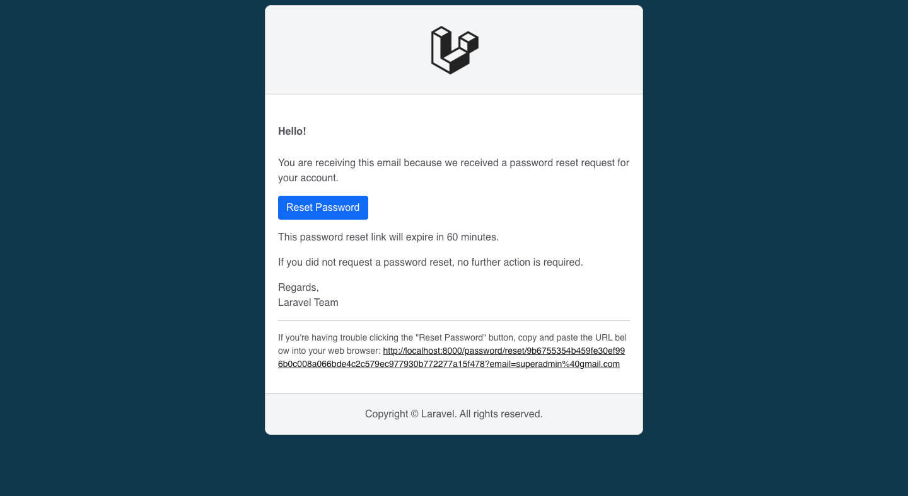

# Laravel Password Reset Email Customization

## Step 1: Create a Custom Notification

Generate a new notification class:

```
php artisan make:notification CustomResetPasswordNotification
```

## Step 2: Update the Notification Logic

Edit `app/Notifications/CustomResetPasswordNotification.php` file to extend the base Laravel reset class and use your own logic or view:

```
<?php

namespace App\Notifications;

use Illuminate\Bus\Queueable;
use Illuminate\Contracts\Queue\ShouldQueue;
use Illuminate\Notifications\Messages\MailMessage;
use Illuminate\Notifications\Notification;

class CustomResetPasswordNotification extends Notification
{
    use Queueable;

    public $token;

    /**
     * Create a new notification instance.
     */
    public function __construct($token)
    {
        //
        $this->token = $token;
    }

    /**
     * Get the notification's delivery channels.
     *
     * @return array<int, string>
     */
    public function via(object $notifiable): array
    {
        return ['mail'];
    }

    /**
     * Get the mail representation of the notification.
     */
    public function toMail(object $notifiable): MailMessage
    {
        // return (new MailMessage)
        //     ->line('The introduction to the notification.')
        //     ->action('Notification Action', url('/'))
        //     ->line('Thank you for using our application!');

        $url = url(route('password.reset', [
            'token' => $this->token,
            'email' => $notifiable->getEmailForPasswordReset(),
        ], false));

        return (new MailMessage)
                ->subject('Reset Your Application Password')
                ->view('emails.password_reset', [
                    'user' => $notifiable,
                    'url' => $url,
                ]);
    }

    /**
     * Get the array representation of the notification.
     *
     * @return array<string, mixed>
     */
    public function toArray(object $notifiable): array
    {
        return [
            //
        ];
    }
}
```

## Step 3: add the `sendPasswordResetNotification` method at the end in your User model class (app/Models/User.php):

```
use App\Notifications\CustomResetPasswordNotification;

//  
public function sendPasswordResetNotification($token)
{
    $this->notify(new CustomResetPasswordNotification($token));
}
```

## Step 4: Make view blade file at `views/emails/password_reset.blade.php` and write desired custom email template or following code:

```
@extends('layouts.emaillayout')

@section('content')

<p><h5><strong>Hello!</strong></h5></p>

<p>You are receiving this email because we received a password reset request for your account.</p>

<p><a href="{!! $url !!}"><button class="btn btn-primary">Reset Password</button></a></p>

<p>This password reset link will expire in {{ config('auth.passwords.users.expire') }} minutes.</p>

<p>If you did not request a password reset, no further action is required.</p>

<p>
    <div>Regards,</div>
    <div>{{ config('app.name') }} Team</div>
</p>

<p><hr /></p>

<p><small>If you're having trouble clicking the "Reset Password" button, copy and paste the URL below into your web browser: <a href="{!! $url !!}">{!! $url !!}</a></small></p>

@endsection
```

## Step 5: Finally, make email view layouts blade file at `views/layouts/emaillayout.blade.php` and put the below code:

```
<!DOCTYPE html PUBLIC "-//W3C//DTD XHTML 1.0 Transitional//EN" "http://www.w3.org/TR/xhtml1/DTD/xhtml1-transitional.dtd">
<html xmlns="http://www.w3.org/1999/xhtml" lang="{{ str_replace('_', '-', app()->getLocale()) }}">
<head>
<title>{{ config('app.name') }}</title>
<meta name="viewport" content="width=device-width, initial-scale=1.0" />
<meta http-equiv="Content-Type" content="text/html; charset=UTF-8" />
<style>
h1{
    font-size: 48px;
}
h2{
    font-size: 32px;
}
h3{
    font-size: 28px;
}
h4{
    font-size: 24px;
}
h5{
    font-size: 16px;
}
small{
    font-size: 14px;
}
body {
    background-color: #10384d;
    color: #52525b;
    font-family: Helvetica, sans-serif, arial;
    -webkit-font-smoothing: antialiased;
    font-size: 16px;
    line-height: 1.5;
    -ms-text-size-adjust: 100%;
    -webkit-text-size-adjust: 100%;
    word-break: break-all;
}
a, a:link, a:hover, a:visited, a:focus, a:active{
    color: #18181b;
}
button, .btn {
    display: inline-block;
    font-weight: 400;
    line-height: 1.5;
    color: #212529;
    text-align: center;
    text-decoration: none;
    vertical-align: middle;
    cursor: pointer;
    -webkit-user-select: none;
    -moz-user-select: none;
    user-select: none;
    background-color: transparent;
    border: 1px solid transparent;
    padding: .375rem .75rem;
    font-size: 1rem;
    border-radius: .25rem;
    transition: color .15s ease-in-out, background-color .15s ease-in-out, border-color .15s ease-in-out, box-shadow .15s ease-in-out;
}
button, .btn-primary {
    color: #fff;
    background-color: #0d6efd;
    border-color: #0d6efd;
}
button:hover, .btn-primary:hover {
    color: #fff;
    background-color: #0b5ed7;
    border-color: #0a58ca;
}
hr{
    border: 0;
    border-top: solid 1px #cacaca;
}
.wrapper{
    background-color: #ffffff;border-radius:10px;border:solid 1px #cacaca;margin:0px auto;max-width: 600px;
}
.header{
    background-color: #f4f5f6;border-radius:10px 10px 0px 0px;border-bottom:solid 1px #cacaca;
}
.header .content-cell{
    padding: 20px; text-align:center;
}
.header img{
    max-width: 350px;
    max-height: 100px;
}
td.body{
    padding: 20px;
}
.footer{
    background-color: #f4f5f6;border-radius:0px 0px 10px 10px;border-top:solid 1px #cacaca;
}
.footer .content-cell{
    padding: 20px; text-align:center;
}
@media only screen and (max-width: 600px) {
    .wrapper{
        max-width: 100% !important;
    }
}
</style>
</head>
<body>
<table class="wrapper" width="100%" cellpadding="0" cellspacing="0" border="0" role="presentation">
    <tr>
        <td align="center">
            <table class="header" width="100%" cellpadding="0" cellspacing="0" border="0" role="presentation">
            <tr>
                <td class="content-cell"><a href="{{ config('app.url') }}" target="_blank" style="display: inline-block;"></a></td>
            </tr>
            </table>
        </td>
    </tr>
    <tr>
        <td class="body">
            <table class="inner-body" width="100%" cellpadding="0" cellspacing="0" border="0" role="presentation">
                <tr>
                    <td class="content-cell">
                        @yield('content')

                    </td>
                </tr>
            </table>
        </td>
    </tr>
    <tr>
        <td align="center">
            <table class="footer" width="100%" cellpadding="0" cellspacing="0" border="0" role="presentation">
            <tr>
                <td class="content-cell">Copyright © {{ config('app.name') }}. All rights reserved.</td>
            </tr>
            </table>
        </td>
    </tr>
</table>
</body>
</html>
```

## Output: 



### Happy to share. Thank You :)